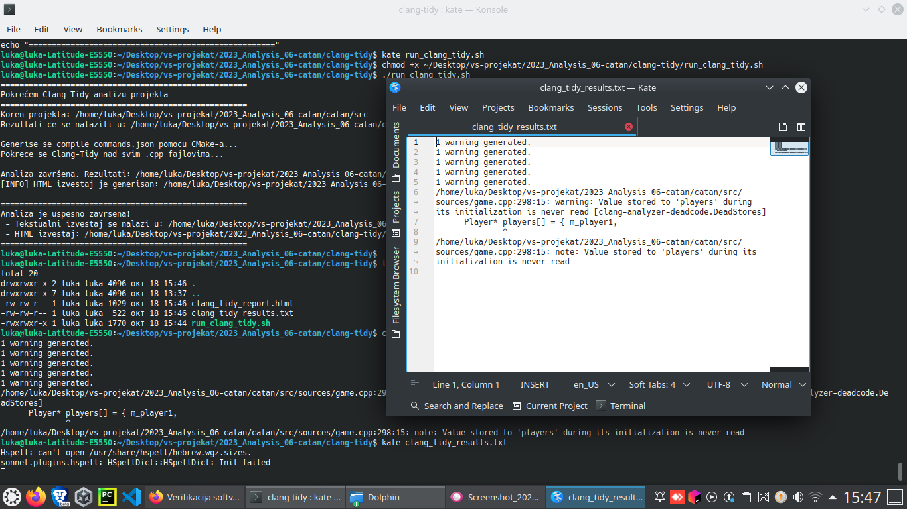
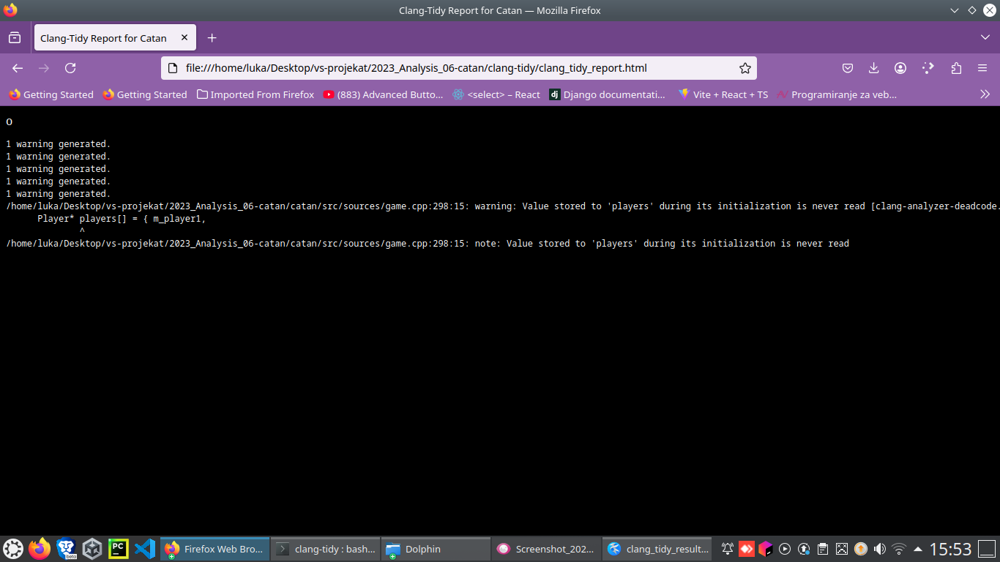
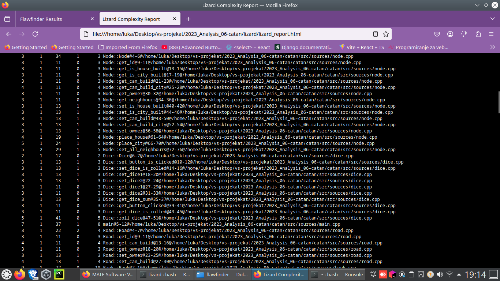
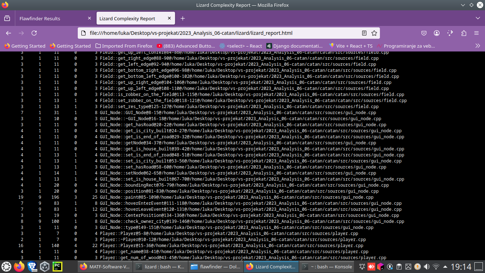
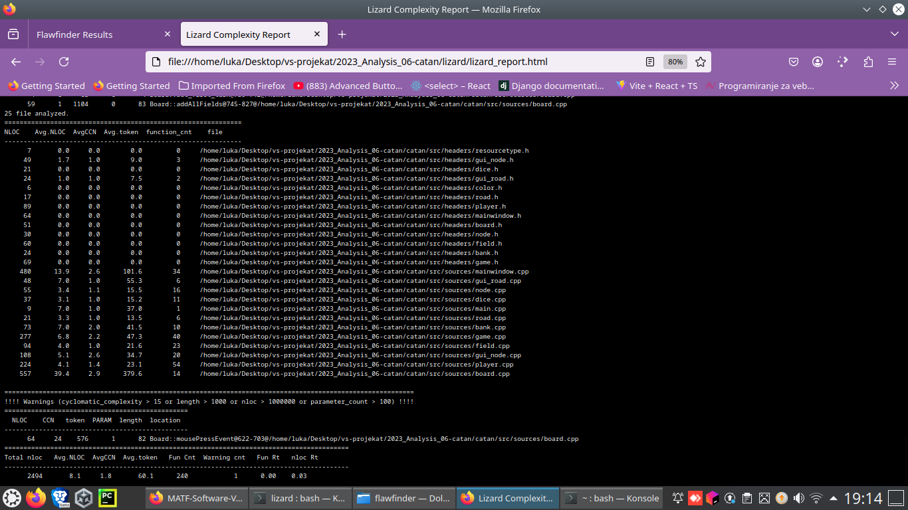

# Izveštaj analize projekta

## Clang-Tidy

**Clang-Tidy** predstavlja jedan od *Clang* zasnovanih alata koji obavlja statičku analizu koda (vrši analiziranje izvornog koda bez njegovog izvršavanja sa ciljem pronalaženja grešaka, poboljšanja kvaliteta koda i ispravljanja neoptimalno napisanih delova koda). **Clang-Tidy** je *C++* linter alati koji analizira kod i pronalazi programske i stilske greške unutar koda.

---
### Instalacija Clang-Tidy i pokretanje analize

Za statičku analizu C++ koda koristimo **Clang-Tidy**, koji se može instalirati na Linux sistemima pomoću sledeće komande:

```bash
sudo apt update && sudo apt install clang-tidy
```

Nakon instalacije, potrebno je kreirati skriptu `run_clang_tidy.sh` koja automatski pokreće analizu nad svim `.cpp` fajlovima u projektu. Skripta definiše koren projekta, build direktorijum, kao i putanje za tekstualni i HTML izveštaj, generiše `compile_commands.json` koristeći CMake i potom pokreće Clang-Tidy nad izvornim fajlovima. Takođe, omogućava opcionalno generisanje HTML izveštaja pomoću alata `aha`.

**AHA** (ANSI HTML Adapter) je alat koji omogućava konverziju ANSI obojenog izlaza iz terminala u HTML izveštaje. U kontekstu analize softvera, može se koristiti za generisanje preglednih HTML izveštaja iz alata koji daju obojen izlaz u terminalu, kao što su `flawfinder`, `cppcheck` ili `clang-tidy`.

Na Linux sistemima, **AHA** se može instalirati komandom:

```bash
sudo apt update && sudo apt install aha
```

`run_clang_tidy.sh`

```bash
#!/bin/bash
set -e

# === KONFIGURACIJA ===
PROJECT_ROOT="$(cd "$(dirname "${BASH_SOURCE[0]}")/../catan/src" && pwd)"
BUILD_DIR="$PROJECT_ROOT/build"
OUTPUT_DIR="$(cd "$(dirname "${BASH_SOURCE[0]}")" && pwd)"
LOG_FILE="$OUTPUT_DIR/clang_tidy_results.txt"
HTML_FILE="$OUTPUT_DIR/clang_tidy_report.html"

echo "====================================================="
echo "Pokrece se Clang-Tidy analizu projekta"
echo "====================================================="
echo "Koren projekta: $PROJECT_ROOT"
echo "Rezultati ce se nalaziti u: $OUTPUT_DIR"
echo ""


if [ ! -d "$BUILD_DIR" ]; then
    echo "Kreira se build direktorijum ukoliko ne postoji..."
    mkdir -p "$BUILD_DIR"
fi

echo "Generise se compile_commands.json pomocu CMake-a..."
cmake -DCMAKE_EXPORT_COMPILE_COMMANDS=ON -S "$PROJECT_ROOT" -B "$BUILD_DIR" > /dev/null

if [ ! -f "$BUILD_DIR/compile_commands.json" ]; then
    echo "[ERROR] compile_commands.json nije pronadjen u $BUILD_DIR!"
    exit 1
fi


echo "Pokrece se Clang-Tidy nad svim .cpp fajlovima..."
find "$PROJECT_ROOT/sources" -name "*.cpp" | xargs clang-tidy -p "$BUILD_DIR" > "$LOG_FILE" 2>&1 || true

echo "Analiza je zavrsena. Rezultati: $LOG_FILE"


if command -v aha >/dev/null 2>&1; then
    cat "$LOG_FILE" | aha --black --title "Clang-Tidy Report for Catan" > "$HTML_FILE"
    echo " HTML izvestaj je generisan: $HTML_FILE"
else
    echo " 'aha' nije instaliran. HTML izvestaj nije generisan."
    echo "      Instaliraj alat aha pomocu: sudo apt install aha"
fi

echo ""
echo "====================================================="
echo "Analiza je uspesno zavrsena!"
echo " - Tekstualni izvestaj se nalazi u: $LOG_FILE"
echo " - HTML izvestaj: $HTML_FILE"
echo "====================================================="
```

Pre nego što se skripta pokrene, potrebno joj je dodeliti izvršna prava:
```bash
chmod +x run_clang_tidy.sh
```
Skripta se pokreće komandom iz `clang-tidy` foldera:
```bash
./run_clang_tidy.sh
```
Rezultati se beleže u `clang_tidy_results.txt`, a može se generisati i  HTML izveštaj, radi bolje preglednosti i ti rezultati ce biti sačuvani  u `clang_tidy_report.html`. Rezultati se mogu videti pozivanjem komande `cat clang_tidy_results.txt` u terminalu ili pokretanjem u browseru putanje koju dobijemo kao rezultat sktipte.





---
### Analiza dobijenih rezultata




 Nakon analize generisanog `clang_tidy_report.html`, Clang-Tidy je detektovao jedan *warning* da promenljiva/niz `players` dobija vrednost prilikom inicijalizacije, ali se ta vrednost nigde ne koristi. Ovo je tzv. *dead store* ili mrtvi kod. Uklanjanjem ovog niza, *warning* će nestati.

- **Lokacija problema:**  
  Fajl: `game.cpp`  
  Linija: 298

---

## Lizard

**Lizard** je alat za analizu kompleksnosti koda, koji omogućava detekciju funkcija sa visokim stepenom složenosti. Analizom koda, Lizard može da izračuna nekoliko metrika za svaku funkciju, uključujući:

- **NLOC (Non-Comment Lines of Code)** – broj linija koda u funkciji
- **CCN (Cyclomatic Complexity Number)** – ciklomatska kompleksnost funkcije
- **Token** – broj tokena u funkciji
- **PARAM** – broj parametara funkcije
- **Length** – broj linija u opsegu funkcije
- **Location** – fajl i linije u kojima se funkcija nalazi

Ove metrike nam pomažu identifikuju delove koda koji mogu biti teško razumljivi, održivi ili potencijalno skloni greškama.

###Preporučeni pragovi za metrike koda

Preporučeni pragovi za osnovne metrike koje se prate:

| Metrika                     | Opis                                                                 | Preporučeni prag                  | Komentar |
|------------------------------|----------------------------------------------------------------------|----------------------------------|----------|
| **NLOC (Non-Comment Lines)** | Broj linija koda koje nisu komentari.                               | ≤ 200 linija po funkciji/fajlu  | Duže funkcije/fajlovi su teže za održavanje i testiranje |
| **Avg.NLOC**                 | Prosečan broj linija po funkciji.                                    | ≤ 20 linija po funkciji          | Funkcije duže od 20 linija treba razmotriti za refaktorisanje |
| **CCN (Cyclomatic Complexity Number)** | Mera složenosti funkcije (broj nezavisnih puteva).         | ≤ 10                             | Veće vrednosti povećavaju rizik od grešaka |
| **Avg.CCN**                  | Prosečna složenost po funkciji.                                      | ≤ 5                              | Preporučuje se održavanje niske prosečne složenosti po fajlu |
| **Token count**              | Broj tokena u funkciji (indirektna mera složenosti i dužine).       | ≤ 50–100 tokena po funkciji     | Veće funkcije mogu biti teže za razumevanje|
| **Function count**           | Broj funkcija po fajlu.                                             | ≤ 20 funkcija po fajlu           | Potencijalno loša modularnost|
| **Parameter count**          | Broj parametara po funkciji.                                         | ≤ 5 parametara                   | Funkcije sa više od 5 parametara mogu biti tešek za testirati i održavati |
| **Length**                   | Dužina funkcije u znakovima (ili tokenima).                          | ≤ 500–1000                       | Duže funkcije su teže za čitanje i razumevanje |


---

## Instalacija Lizard-a i pokretanje analize

**Lizard** je Python alat i može se instalirati pomoću pip-a:

```bash
pip install lizard
```

Nakon instalacije, kreiramo skriptu `run_lizard.sh` koja automatski pokreće analizu nad svim izvornim fajlovima projekta i generiše HTML izveštaj.

`run_lizard.sh`

```bash
#!/bin/bash
set -e

PROJECT_ROOT="$(cd "$(dirname "${BASH_SOURCE[0]}")/../catan/src" && pwd)"
OUTPUT_DIR="$(cd "$(dirname "${BASH_SOURCE[0]}")" && pwd)"
REPORT_FILE="$OUTPUT_DIR/lizard_report.html"

echo "============================================"
echo "Pokrece se Lizard analiza kompleksnosti"
echo "============================================"
echo "Koren projekta: $PROJECT_ROOT"
echo "Izvestaj ce biti sacuvan u: $REPORT_FILE"
echo ""

if ! command -v lizard &> /dev/null; then
    echo "Greska: Lizard nije instaliran."
    echo "Instaliraj ga komandom: pip install lizard"
    exit 1
fi

echo "Pokrece se Lizard analiza..."
lizard "$PROJECT_ROOT" | aha --black --title "Lizard Complexity Report" > "$REPORT_FILE"


echo ""
echo "Analiza je zavrsena."
echo "Izvestaj se nalazi u: $REPORT_FILE"
echo "Mozete ga otvoriti u browseru: $REPORT_FILE"
```


Pre pokretanja skripte, potrebno je dodeliti izvršna prava:
```bash
chmod +x run_lizard.sh
```
Skripta se pokreće komandom iz `lizard` foldera:
```bash
./run_lizard.sh
```

---
### Analiza dobijenih rezultata


Rezultati analize se čuvaju u `lizard_report.html` i mogu se otvoriti u browseru radi preglednosti. Ovde ću prikazati delove tog izveštaja:







### Analiza dobijenog izveštaja

### 1. Najveći broj linija koda i broj funkcija

| Fajl           | NLOC | Broj funkcija | Prosečna CCN |
|----------------|------|---------------|--------------|
| game.cpp       | 277  | 40            | 2.2          |
| board.cpp      | 557  | 14            | 2.9          |
| mainwindow.cpp | 480  | 34            | 2.6          |

 Ovi fajlovi sadrže najveći broj linija koda i funkcija u projektu, ali CNN vrednost je u preporucenim granicama.


### 2. Fajlovi sa značajnom prosečnom dužinom funkcije ili kompleksnošću

| Fajl           | Prosečna dužina funkcije (tokeni) | Prosečna CCN |
|----------------|----------------------------------|--------------|
| mainwindow.cpp | 101.6                            | 2.6          |
| player.cpp     | 23.1                             | 1.4          |
| board.cpp      | 379.6                            | 2.9          |

 Fajl `board.cpp` sadrži izuzetno dugu funkciju, što može otežati održavanje.

---

### 3. Funkcija sa visokim upozorenjem

- **Funkcija:** `Board::mousePressEvent`
- **Fajl:** `board.cpp`
- **Linije:** 622-703
- **NLOC:** 64
- **Tokeni:** 576
- **CCN:** 24 (preporučena ≤ 10)

Ova funkcija definitivno zahteva refaktorisanje zbog visoke složenosti i dužine.

---

### 4. Header fajlovi

Većina header fajlova (resourcetype.h, dice.h, player.h, board.h itd.):

- Nemaju funkcije (function_cnt = 0)
- Imaju veoma malu prosečnu dužinu koda (pratimo metrike Avg.NLOC, Avg.token)
  
 Ovo je očekivano i ukazuje na dobru modularnost i jasno separisanje deklaracija od implementacija.

---

### 5. Statistički podaci na nivou celog projekta

| Metrika                     | Vrednost      |
|------------------------------|--------------|
| Ukupan broj linija koda (NLOC)| 2494         |
| Prosečna dužina funkcije      | 8.1 NLOC     |
| Prosečna kompleksnost (CCN)   | 1.8          |
| Ukupan broj funkcija          | 240          |
| Funkcije sa upozorenjem       | 1            |
| Procenat koda pod upozorenjem | ~0.03        |

 Sve metrike su unutar preporučenih vrednosti, što pokazuje kvalitetno strukturiran i pregledan kod.

---
