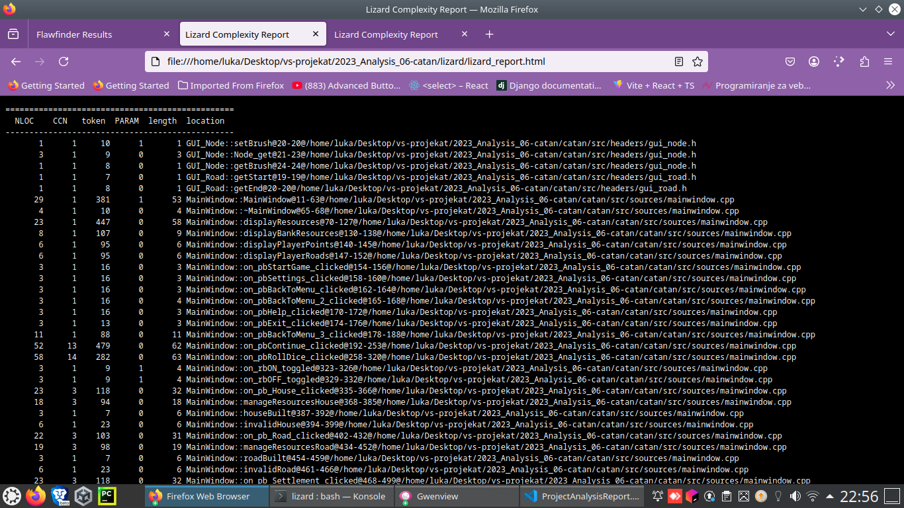

# Izveštaj analize projekta

## Clang-Tidy

**Clang-Tidy** predstavlja jedan od *Clang* zasnovanih alata koji obavlja statičku analizu koda (vrši analiziranje izvornog koda bez njegovog izvršavanja sa ciljem pronalaženja grešaka, poboljšanja kvaliteta koda i ispravljanja neoptimalno napisanih delova koda). **Clang-Tidy** je *C++* linter alati koji analizira kod i pronalazi programske i stilske greške unutar koda.

---
### Instalacija Clang-Tidy i pokretanje analize

Za statičku analizu C++ koda koristimo **Clang-Tidy**, koji se može instalirati na Linux sistemima pomoću sledeće komande:

```bash
sudo apt update && sudo apt install clang-tidy
```

Nakon instalacije, potrebno je kreirati skriptu `run_clang_tidy.sh` koja automatski pokreće analizu nad svim `.cpp` fajlovima u projektu. Skripta definiše koren projekta, build direktorijum, kao i putanje za tekstualni i HTML izveštaj, generiše `compile_commands.json` koristeći CMake i potom pokreće Clang-Tidy nad izvornim fajlovima. Takođe, omogućava opcionalno generisanje HTML izveštaja pomoću alata `aha`.

**AHA** (ANSI HTML Adapter) je alat koji omogućava konverziju ANSI obojenog izlaza iz terminala u HTML izveštaje. U kontekstu analize softvera, može se koristiti za generisanje preglednih HTML izveštaja iz alata koji daju obojen izlaz u terminalu, kao što su `flawfinder`, `cppcheck` ili `clang-tidy`.

Na Linux sistemima, **AHA** se može instalirati komandom:

```bash
sudo apt update && sudo apt install aha
```

`run_clang_tidy.sh`

```bash
#!/bin/bash
set -e

# === KONFIGURACIJA ===
PROJECT_ROOT="$(cd "$(dirname "${BASH_SOURCE[0]}")/../catan/src" && pwd)"
BUILD_DIR="$PROJECT_ROOT/build"
OUTPUT_DIR="$(cd "$(dirname "${BASH_SOURCE[0]}")" && pwd)"
LOG_FILE="$OUTPUT_DIR/clang_tidy_results.txt"
HTML_FILE="$OUTPUT_DIR/clang_tidy_report.html"

echo "====================================================="
echo "Pokrece se Clang-Tidy analizu projekta"
echo "====================================================="
echo "Koren projekta: $PROJECT_ROOT"
echo "Rezultati ce se nalaziti u: $OUTPUT_DIR"
echo ""


if [ ! -d "$BUILD_DIR" ]; then
    echo "Kreira se build direktorijum ukoliko ne postoji..."
    mkdir -p "$BUILD_DIR"
fi

echo "Generise se compile_commands.json pomocu CMake-a..."
cmake -DCMAKE_EXPORT_COMPILE_COMMANDS=ON -S "$PROJECT_ROOT" -B "$BUILD_DIR" > /dev/null

if [ ! -f "$BUILD_DIR/compile_commands.json" ]; then
    echo "[ERROR] compile_commands.json nije pronadjen u $BUILD_DIR!"
    exit 1
fi


echo "Pokrece se Clang-Tidy nad svim .cpp fajlovima..."
find "$PROJECT_ROOT/sources" -name "*.cpp" | xargs clang-tidy -p "$BUILD_DIR" > "$LOG_FILE" 2>&1 || true

echo "Analiza je zavrsena. Rezultati: $LOG_FILE"


if command -v aha >/dev/null 2>&1; then
    cat "$LOG_FILE" | aha --black --title "Clang-Tidy Report for Catan" > "$HTML_FILE"
    echo " HTML izvestaj je generisan: $HTML_FILE"
else
    echo " 'aha' nije instaliran. HTML izvestaj nije generisan."
    echo "      Instaliraj alat aha pomocu: sudo apt install aha"
fi

echo ""
echo "====================================================="
echo "Analiza je uspesno zavrsena!"
echo " - Tekstualni izvestaj se nalazi u: $LOG_FILE"
echo " - HTML izvestaj: $HTML_FILE"
echo "====================================================="
```

Pre nego što se skripta pokrene, potrebno joj je dodeliti izvršna prava:
```bash
chmod +x run_clang_tidy.sh
```
Skripta se pokreće komandom iz `clang-tidy` foldera:
```bash
./run_clang_tidy.sh
```
Rezultati se beleže u `clang_tidy_results.txt`, a može se generisati i  HTML izveštaj, radi bolje preglednosti i ti rezultati ce biti sačuvani  u `clang_tidy_report.html`. Rezultati se mogu videti pozivanjem komande `cat clang_tidy_results.txt` u terminalu ili pokretanjem u browseru putanje koju dobijemo kao rezultat sktipte.


---
### Analiza dobijenih rezultata


 Nakon analize generisanog `clang_tidy_report.html`, Clang-Tidy je detektovao jedan *warning* da promenljiva/niz `players` dobija vrednost prilikom inicijalizacije, ali se ta vrednost nigde ne koristi. Ovo je tzv. *dead store* ili mrtvi kod. Uklanjanjem ovog niza, *warning* će nestati.

- **Lokacija problema:**  
  Fajl: `game.cpp`  
  Linija: 298

---

## Lizard

**Lizard** je alat za analizu kompleksnosti koda, koji omogućava detekciju funkcija sa visokim stepenom složenosti. Analizom koda, Lizard može da izračuna nekoliko metrika za svaku funkciju, uključujući:

- **NLOC (Non-Comment Lines of Code)** – broj linija koda u funkciji
- **CCN (Cyclomatic Complexity Number)** – ciklomatska kompleksnost funkcije
- **Token** – broj tokena u funkciji
- **PARAM** – broj parametara funkcije
- **Length** – broj linija u opsegu funkcije
- **Location** – fajl i linije u kojima se funkcija nalazi

Ove metrike nam pomažu identifikuju delove koda koji mogu biti teško razumljivi, održivi ili potencijalno skloni greškama.

### Preporučeni pragovi za metrike koda


| Metrika                     | Opis                                                                 | Preporučeni prag                  | Komentar |
|------------------------------|----------------------------------------------------------------------|----------------------------------|----------|
| **NLOC (Non-Comment Lines)** | Broj linija koda koje nisu komentari.                               | ≤ 200 linija po funkciji/fajlu  | Duže funkcije/fajlovi su teže za održavanje i testiranje |
| **Avg.NLOC**                 | Prosečan broj linija po funkciji.                                    | ≤ 20 linija po funkciji          | Funkcije duže od 20 linija treba razmotriti za refaktorisanje |
| **CCN (Cyclomatic Complexity Number)** | Mera složenosti funkcije (broj nezavisnih puteva).         | ≤ 10                             | Veće vrednosti povećavaju rizik od grešaka |
| **Avg.CCN**                  | Prosečna složenost po funkciji.                                      | ≤ 5                              | Preporučuje se održavanje niske prosečne složenosti po fajlu |
| **Token count**              | Broj tokena u funkciji (indirektna mera složenosti i dužine).       | ≤ 50–100 tokena po funkciji     | Veće funkcije mogu biti teže za razumevanje|
| **Function count**           | Broj funkcija po fajlu.                                             | ≤ 20 funkcija po fajlu           | Potencijalno loša modularnost|
| **Parameter count**          | Broj parametara po funkciji.                                         | ≤ 5 parametara                   | Funkcije sa više od 5 parametara mogu biti tešek za testirati i održavati |
| **Length**                   | Dužina funkcije u znakovima (ili tokenima).                          | ≤ 500–1000                       | Duže funkcije su teže za čitanje i razumevanje |


---

## Instalacija Lizard-a i pokretanje analize

**Lizard** je Python alat i može se instalirati pomoću pip-a:

```bash
pip install lizard
```

Nakon instalacije, kreiramo skriptu `run_lizard.sh` koja automatski pokreće analizu nad svim izvornim fajlovima projekta i generiše HTML izveštaj.

`run_lizard.sh`

```bash
#!/bin/bash
set -e

PROJECT_ROOT="$(cd "$(dirname "${BASH_SOURCE[0]}")/../catan/src" && pwd)"
OUTPUT_DIR="$(cd "$(dirname "${BASH_SOURCE[0]}")" && pwd)"
REPORT_FILE="$OUTPUT_DIR/lizard_report.html"

echo "============================================"
echo "Pokrece se Lizard analiza kompleksnosti"
echo "============================================"
echo "Koren projekta: $PROJECT_ROOT"
echo "Izvestaj ce biti sacuvan u: $REPORT_FILE"
echo ""

if ! command -v lizard &> /dev/null; then
    echo "Greska: Lizard nije instaliran."
    echo "Instaliraj ga komandom: pip install lizard"
    exit 1
fi

echo "Pokrece se Lizard analiza..."
lizard "$PROJECT_ROOT" | aha --black --title "Lizard Complexity Report" > "$REPORT_FILE"


echo ""
echo "Analiza je zavrsena."
echo "Izvestaj se nalazi u: $REPORT_FILE"
echo "Mozete ga otvoriti u browseru: $REPORT_FILE"
```


Pre pokretanja skripte, potrebno je dodeliti izvršna prava:
```bash
chmod +x run_lizard.sh
```
Skripta se pokreće komandom iz `lizard` foldera:
```bash
./run_lizard.sh
```

---
### Analiza dobijenih rezultata


Rezultati analize se čuvaju u `lizard_report.html` i mogu se otvoriti u browseru radi preglednosti. Ovde ću prikazati delove tog izveštaja:




### Analiza dobijenog izveštaja

### 1. Najveći broj linija koda i broj funkcija

| Fajl           | NLOC | Broj funkcija | Prosečna CCN |
|----------------|------|---------------|--------------|
| game.cpp       | 277  | 40            | 2.2          |
| board.cpp      | 557  | 14            | 2.9          |
| mainwindow.cpp | 480  | 34            | 2.6          |

 Ovi fajlovi sadrže najveći broj linija koda i funkcija u projektu, ali CNN vrednost je u preporucenim granicama.


### 2. Fajlovi sa značajnom prosečnom dužinom funkcije ili kompleksnošću

| Fajl           | Prosečna dužina funkcije (tokeni) | Prosečna CCN |
|----------------|----------------------------------|--------------|
| mainwindow.cpp | 101.6                            | 2.6          |
| player.cpp     | 23.1                             | 1.4          |
| board.cpp      | 379.6                            | 2.9          |

 Fajl `board.cpp` sadrži izuzetno dugu funkciju, što može otežati održavanje.

---

### 3. Funkcija sa visokim upozorenjem

- **Funkcija:** `Board::mousePressEvent`
- **Fajl:** `board.cpp`
- **Linije:** 622-703
- **NLOC:** 64
- **Tokeni:** 576
- **CCN:** 24 (preporučena ≤ 10)

Ova funkcija definitivno zahteva refaktorisanje zbog visoke složenosti i dužine.

---

### 4. Header fajlovi

Većina header fajlova (resourcetype.h, dice.h, player.h, board.h itd.):

- Nemaju funkcije (function_cnt = 0)
- Imaju veoma malu prosečnu dužinu koda (pratimo metrike Avg.NLOC, Avg.token)
  
 Ovo je očekivano i ukazuje na dobru modularnost i jasno separisanje deklaracija od implementacija.

---

### 5. Statistički podaci na nivou celog projekta

| Metrika                     | Vrednost      |
|------------------------------|--------------|
| Ukupan broj linija koda (NLOC)| 2494         |
| Prosečna dužina funkcije      | 8.1 NLOC     |
| Prosečna kompleksnost (CCN)   | 1.8          |
| Ukupan broj funkcija          | 240          |
| Funkcije sa upozorenjem       | 1            |
| Procenat koda pod upozorenjem | ~0.03        |

 Sve metrike su unutar preporučenih vrednosti, što pokazuje kvalitetno strukturiran i pregledan kod.

---

## Cppcheck

**Cppcheck** je alat koji se koristi za statičku analizu C i C++ koda. Osnovna uloga je otkrivanje potencijalnih problema pre pokretanja programa. Detektuje curenja memorije, neinicijalizovane promenljive, potencijalne probleme sa pokazivačima...


---

### Instalacija Cppcheck-a i pokretanje analize

Na Linux sistemima, Cppcheck se može instalirati komandom:

```bash
sudo apt update && sudo apt install cppcheck
```

Nakon instalacije, kreiramo skriptu `run_cppcheck.sh` koja automatski pokreće analizu nad svim `*.cpp` i `*.h` fajlovima projekta (osim `moc_*.cpp` zbog slozenosti poziva) i generiše HTML izveštaj pomocu alata `aha`.

`run_cppcheck.sh`

```bash

#!/bin/bash
set -e

PROJECT_ROOT="$(cd "$(dirname "${BASH_SOURCE[0]}")/../catan/src" && pwd)"
OUTPUT_DIR="$(cd "$(dirname "${BASH_SOURCE[0]}")" && pwd)"
HTML_DIR="$OUTPUT_DIR/html_report"

echo "============================================"
echo "Pokrece se Cppcheck analiza projekta"
echo "============================================"
echo "Koren projekta: $PROJECT_ROOT"
echo "Rezultati ce se nalaziti u: $HTML_DIR"
echo ""

mkdir -p "$HTML_DIR"

echo "Pokrece se cppcheck nad .cpp i .h fajlovima..."

find "$PROJECT_ROOT" \( -path "$PROJECT_ROOT/build" -o -name "moc_*.cpp" \) -prune -o \
    \( -name "*.cpp" -o -name "*.h" \) -print | \
    xargs cppcheck --enable=all --std=c++17 --language=c++ --inconclusive 2>&1 | \
    aha --black --title "Cppcheck Report for Catan" > "$HTML_DIR/cppcheck_report.html"

echo "Analiza je zavrsena. Otvoriti  $HTML_DIR/cppcheck_report.html u browseru kako bi se videli rezultati"

```


Pre pokretanja skripte, potrebno je dodeliti izvršna prava:
```bash
chmod +x run_cppcheck.sh
```
Skripta se pokreće komandom iz `cppcheck` foldera:
```bash
./run_cppcheck.sh
```

Generise se `html/cppcheck_report.html` se mogu videti pokretanjem putanje u browseru koju dobijemo kao rezultat sktipte `run_cppcheck.sh`.


### Analiza dobijenih rezultata

#### Objašnjenje parametra `--enable=all` u Cppcheck analizi

Opcija `--enable=all` aktivirasve dostupne grupe provera u okviru alata.  
Koristi se kada želimo najdetaljniju statičku analizu C++ koda, uključujući i upozorenja koja nisu uvek kritična, ali mogu ukazati na loše prakse, neefikasan kod ili potencijalne greške.

---
Kategorije koje obuhvata:

1. **`warning`**  
   - Detektuje uobičajene potencijalne greške


2. **`style`**  
   - Analizira stil pisanja koda i dobre prakse
  

3. **`performance`**  
   - Ukazuje na neefikasne konstrukcije
 

4. **`portability`**  
   - Proverava prenosivost koda između različitih platformi

5. **`information`**  
    - Daje korisne informacije koje nisu greške:
 

6. **`unusedFunction`**  
   - Pronalazi funkcije koje su definisane, ali se nigde ne pozivaju.

7. **`missingInclude`**  
   - Prikazuje nedostajuće `#include` direktive koje mogu izazvati greške pri kompilaciji.

8. **`experimental`**  
   - Aktivira eksperimentalne provere koje nisu u potpunosti stabilne, ali mogu otkriti dodatne probleme u kodu.

---

S obzirom da smo koristili opciju `--enable=all` pri pozivu ovog alata, sam report je veceg obima, ali veoma koristan ukoliko zelimo da unapredimo nas projekat.

Neki od primera iz izveštaja:

* > catan/src/sources/field.cpp:15:8: warning: Member variable 'Field::m_res_type' is not initialized in the constructor. [uninitMemberVar]  
  Field::Field(int id, int number)

   **Komentar:** Alat upozorava da član `m_res_type` klase `Field` nije inicijalizovan u konstruktoru, što može dovesti do nepredvidivog ponašanja.

---

* > catan/src/sources/game.cpp:298:15: style: Variable 'players' is assigned during initialization but never used. [unusedVariable]  
  Player* players[] = { m_player1, m_player2, m_player3, m_player4 };

   **Komentar:** Alat detektuje da se promenljiva `players` inicijalizuje, ali se nikada ne koristi — a ovo upozorenje smo vec dobili primenom alata `clang-tidy`.

---

* > catan/src/sources/player.cpp:45:0: performance: Parameter 'name' should be passed by const reference. [passedByValue]  
  Player::Player(std::string name)

   **Komentar:** Alat predlaže da se parametar `name` prosledi kao `const std::string&` radi optimizacije performansi i radi izbegavanja nepotrebnog kopiranja.

---

* > catan/src/sources/node.cpp:12:3: style: Member variable 'Node::m_id' is not initialized in the constructor. [uninitMemberVar]  
  Node::Node(int id)

   **Komentar:** Alat upozorava da nije inicijalizovan član `m_id` klase `Node` i preporučuje se dodavanje u listu inicijalizatora.

---


 
 
 


### Najčešći problemi:

1. Neinicijalizovani članovi u konstruktorima 
2. Razlike u imenima argumenata
3. Metode koje bi trebalo označiti kao `const`
4. Nedostatak `explicit` u konstruktorima sa jednim argumentom
  
Ispravljanje navedenih problema bi doprinelo:

- Povećanju robustnosti i stabilnosti koda  
- Poboljšanju čitljvosti i održavanja koda  
- Smanjenju potencijalnih grešaka pri izvršavnju programa


---

## Flawfinder


**Flawfinder** je alat za statičku bezbednosnu analizu C/C++ koda koji traži poznate rizične funkcije i obrasce (npr. `strcpy`, `sprintf`, `srand`, itd.) i ocenjuje ih po nivou rizika. Alat daje brz pregled potencijalnih sigurnosnih problema koje je potrebno ručno proveriti i proceniti.

---


### Instalacija Flawfinder-a i pokretanje analze

Na Linux sistemima Flawfinder se može instalirati pomoću:

```bash
sudo apt update && sudo apt install flawfinder
```

Nakon instalacije, potrebno je kreirati skriptu `run_flawfinder.sh` koja automatski pokreće analizu u projektu nad `PROJECT_ROOT`-om. Skripta omogućava opcionalno generisanje HTML izveštaja `flawfinder_result.html`.

`run_flawfinder.sh`

```bash
#!/bin/bash
set -e

PROJECT_ROOT="$(cd "$(dirname "${BASH_SOURCE[0]}")/../catan/src" && pwd)"
OUTPUT_DIR="$(cd "$(dirname "${BASH_SOURCE[0]}")" && pwd)"
REPORT_FILE="$OUTPUT_DIR/flawfinder_result.html"


echo "============================================"
echo "Pokrece se Flawfinder analiza projekta"
echo "============================================"
echo "Koren projekta: $PROJECT_ROOT"
echo "Rezultati ce se nalaziti u: $REPORT_FILE"
echo ""


if ! command -v flawfinder &> /dev/null; then
    echo "Greska: Flawfinder nije instaliran."
    echo "Instalirati Flawfinder: sudo apt install flawfinder"
    exit 1
fi

echo "Pokrece se flawfinder..."
flawfinder --html "$PROJECT_ROOT" > "$REPORT_FILE"

echo ""
echo "Analiza je zavrsena."
echo "Izvestaj se nalazi u: $REPORT_FILE"
echo "Izvestaj se moze otvoriti u browseru komandom: xdg-open $REPORT_FILE"
```

Pre nego što se skripta pokrene, potrebno joj je dodeliti izvršna prava:
```bash
chmod +x run_flawfinder.sh
```
Skripta se pokreće komandom iz `flawfinder` foldera:
```bash
./run_flawfinder.sh
```

Generise se `flawfinder_result.html` i rezultati izvestaja se mogu videti pokretanjem putanje u browseru, koju dobijemo kao rezultat sktipte `run_flawfinder.sh`.


---
### Analiza dobijenih rezultata

`flawfinder_result.html`


Neki od primera iz izveštaja:

* > `/home/luka/.../catan/src/sources/dice.cpp:48: [3] (random)`  
  **srand**: Ova funkcija nije dovoljno sigurna za generisanje nasumičnih vrednosti koje se koriste u bezbednosno osetljivim funkcijama (CWE-327).  
  **Komentar:** Korišćenje `srand`/`rand` za bezbednosne namene nije preporučljivo  

* > `/home/luka/.../catan/src/build/.../moc_board.cpp:25: [2] (buffer)`  
  **char**: Statički alocirani nizovi mogu biti nepravilno ograničeni i dovesti do prelivanja (CWE-119/CWE-120).  
  **Komentar:** Ove poruke se javljaju u auto-generisanim `moc_*.cpp` fajlovima i iako su ti fajlovi generisani, vredi proveriti ulaze i koristiti bezbednije funkcije ili se osigurati da imamo dovoljno velik buffer.

* > `/home/luka/.../catan/src/build/.../moc_gui_node.cpp:25: [2] (buffer)`  
  **Komentar:** Isto upozorenje za potencijalno prelivanje bafera.

* > `/home/luka/.../catan/src/build/.../moc_gui_road.cpp:25: [2] (buffer)`  
  **Komentar:** Isto upozorenje za potencijalno prelivanje bafera.

* > `/home/luka/.../catan/src/build/.../moc_mainwindow.cpp:25: [2] (buffer)`  
  **Komentar:** Isto upozorenje za potencijalno prelivanje bafera.

#### Statistika iz izveštaja: ####

- **Hits (ukupno detektovanih "hitova")**: 5  - prikazanih iznad
- **Lines analyzed**: 2,186,390 (vreme analize ~158 s)  
- **Physical Source LInes of code**: 2,184,727  

Hits po nivou rizika (Hits@level):

- level 2: 4  
- level 3: 1  
- ostali nivoi: 0  

 Svaki "hit" ne znači stvarnu ranjivost — Flawfinder daje indikacije koje ipak treba ručno pregledati i razmotriti, ali Ispravljanje navedenih problema i primena preporuka iz izveštaja bi značajno doprinelo poboljšanju bezbednosti i robusnosti projekta.

---
## Valgrind - Memcheck 

**Memcheck** je alat koji se prilikom korišćenja Valgrind-a podrazumevano poziva. Koristi se za detektovanje memorijskih grešaka i sprovođenja analize nad mašinskim kodom. 
Upotrebom *Memcheck*-a mogu se otkriti različite vrste problema, kao što su curenja memorije, pristup ili upisivanje vrednosti van opsega, korišćenje neinicijalizovanih vrednosti, pristup već oslobođenoj memoriji.

Dodatne opcije koje su korišćene prilikom analize:
- *--leak-check=full* : daje informacije o svim definitivno izgubljenim ili eventualno izgubljenim blokovima, uključujući i informacije o njihovoj alokaciji
- *--track-origins=yes* : omogućava lakše pronalaženje dela programa u kom se nalazi memorijski propust (može znatno usporiti rad alata)
-  *--show-lead-kinds=all* : prikazuje sve vrste curenja memorije u programu
- *--log-file*: rezultati analize će biti upisani u `memcheck_results.txt` fajl

### Instalacija Memchecka-a i pokretanje analize

Na Linux sistemima, Valgrind se može instalirati komandom:

```bash
sudo apt update && sudo apt install valgrind
```

Nakon instalacije, kreiramo skriptu `run_memcheck.sh` koja automatski pokreće analizu. Rezultati se mogu videti pozivanjem komande `cat memcheck_results.txt` u terminalu.


`run_cppcheck.sh`

```bash
set -xe

EXEC_PATH="../../catan/src/build/Catan"

REPORT_FILE="memcheck_results.txt"

SUPP_FILE="suppressions.supp"

if [ ! -f "$EXEC_PATH" ]; then
    echo "Greska: izvrsni fajl nije pronadjen!"
    exit 1
fi

echo "Pokrece se Valgrind Memcheck nad: $EXEC_PATH"
echo "Rezultati se nalaze u: $REPORT_FILE"
echo ""

valgrind --tool=memcheck \
         --track-origins=yes \
         --leak-check=full \
         --show-leak-kinds=all \
         --log-file="$REPORT_FILE" \
         "$EXEC_PATH"

echo "Memcheck je uspesno zavrsen"
```

Pre nego što se skripta pokrene, potrebno joj je dodeliti izvršna prava:
```bash
chmod +x run_memcheck.sh
```
Skripta se pokreće komandom iz `valgrind/memcheck` foldera:
```bash
./run_memcheck.sh
```

---
### Analiza dobijenih rezultata

 Rezultati se mogu videti pozivanjem komande `cat memcheck_results.txt` u terminalu.

 Delovi  izveštaja:


Sam fajl `memcheck_results.txt` je veoma velikog kapaciteta, zato što sadrži rezultate nalik ovom, koji nam govore o „still reachable” blokovima memorije. Oni ne predstavljaju stvarna curenja memorije, već memoriju koja je još uvek dostupna u trenutku završetka programa, ali nije eksplicitno oslobođena (obično zato što je alocirana u globalnom kontekstu biblioteka).


```bash
==59962== 132,189 bytes in 110 blocks are still reachable in loss record 2,394 of 2,394
==59962==    at 0x483DD99: calloc (in /usr/lib/x86_64-linux-gnu/valgrind/vgpreload_memcheck-amd64-linux.so)
==59962==    by 0x400D283: _dl_new_object (dl-object.c:89)
==59962==    by 0x4006E96: _dl_map_object_from_fd (dl-load.c:997)
==59962==    by 0x400A61A: _dl_map_object (dl-load.c:2236)
==59962==    by 0x400F514: openaux (dl-deps.c:64)
==59962==    by 0x5EE3B47: _dl_catch_exception (dl-error-skeleton.c:208)
==59962==    by 0x400F962: _dl_map_object_deps (dl-deps.c:248)
==59962==    by 0x4015DAF: dl_open_worker (dl-open.c:571)
==59962==    by 0x5EE3B47: _dl_catch_exception (dl-error-skeleton.c:208)
==59962==    by 0x4015609: _dl_open (dl-open.c:837)
==59962==    by 0x666034B: dlopen_doit (dlopen.c:66)
==59962==    by 0x5EE3B47: _dl_catch_exception (dl-error-skeleton.c:208)
==59962== 
```

Na samom kraju izveštaja imamo i *leak summary*, na osnovu kog vidimo da je 348B definitivno izgubljeno, a 1856B izgubljeno posredno, jer je ova memorija bila povezana sa objektima koji su već izgubljeni (npr. pokazivač unutar strukture koja je izgubljena). Ukupno je registrovano 435 grešaka raspoređenih u 11 različitih konteksta. Dve greške su potisnute, što znači da su ignorisane jer potiču iz sistemskih biblioteka.  

Ukupno curenje memorije iznosi oko ~2 KB, što ne predstavlja veliki problem, ali svakako bi trebalo obratiti pažnju na mesta gde se alocira memorija pomoću `new` bez eksplicitnog `delete`.


```bash
==59962== LEAK SUMMARY:
==59962==    definitely lost: 348 bytes in 3 blocks
==59962==    indirectly lost: 1,856 bytes in 37 blocks
==59962==      possibly lost: 0 bytes in 0 blocks
==59962==    still reachable: 719,431 bytes in 11,839 blocks
==59962==         suppressed: 0 bytes in 0 blocks
==59962== 
==59962== For lists of detected and suppressed errors, rerun with: -s
==59962== ERROR SUMMARY: 435 errors from 11 contexts (suppressed: 2 from 2)
```

---

## Valgrind – Massif

**Massif** je alat za profajliranje hip memorije. Detektuje memoriju koja fizički nije iscurela, ali se ne upotrebljava i samim tim zauzima prostor koji bi mogao da bude bolje iskorišćen. Massif nam može reći i koliko memorije na hipu program koristi i tačnu liniju koda koja je zaslužna za njegovu alokaciju.

---

### Instalacija Massif-a i pokretanje analize

Alat Massif se takodje nalazi u sklopu alata *Valgrind*, pa nije potrebna ponovna instalacija. 

Za pokretanje analize koristi se sledeća skripta `run_massif.sh`:

```bash
#!/bin/bash
set -xe

EXEC_PATH="../../catan/src/build/Catan"
REPORT_FILE="massif_results.log"
OUT_FILE="massif.out.%p"

if [ ! -f "$EXEC_PATH" ]; then
    echo "Greska: izvrsni fajl nije pronadjen!"
    exit 1
fi

echo "Pokrece se Valgrind Massif nad: $EXEC_PATH"
echo "Log fajl: $REPORT_FILE"
echo "Massif izlaz: $OUT_FILE"
echo ""

valgrind --tool=massif \
         --heap=yes \
         --time-unit=ms \
         --log-file="$REPORT_FILE" \
         --massif-out-file="$OUT_FILE" \
         "$EXEC_PATH"

echo "Massif profajliranje je zavrseno"
echo ""
echo "Za pregled koristiti komandu:"
echo "ms_print massif.out.<PID> | less"
```
Pre nego što se skripta pokrene, potrebno joj je dodeliti izvršna prava:
```bash
chmod +x run_massif.sh
```
Skripta se pokreće komandom iz `valgrind/massif` foldera:
```bash
./run_massif.sh
```

Generisu se dva fajla `massif_results.log` i `massif_results.txt`. Rezultati Massif analize mogu se pregledati pomoću alata `ms_print`, koji generiše tabelu zauzeća memorije kroz vreme izvršavanja programa.


---
### Analiza dobijenih rezultata

Rezultati se mogu videti pozivanjem komande `cat massif_results.txt` u terminalu.


Primećujemo da je tokom pokretanja Massif-a, došlo je do ostećenja/korupcije heap metapodataka:

```bash
valgrind: m_mallocfree.c:305 (get_bszB_as_is): Assertion 'bszB_lo == bszB_hi' failed.
Heap block lo/hi size mismatch: lo = 65, hi = 97.
This is probably caused by your program erroneously writing past the
end of a heap block and corrupting heap metadata.
```

Masif ne može da dovrši profajliranje jer je heap u tom trenutku kompromitovan. 
Ako pogledamo dobijeni *stack trace*, on ukazuje na problem unutar destruktora klase `GUI_Node` i `Board`, kao i prilikom čišćenja `QGraphicsScene`, sto se poklapa i sa rezultatima prethodno primenjenih alata.

```bash
GUI_Node::~GUI_Node()
Board::~Board()
QGraphicsScene::~QGraphicsScene()
MainWindow::~MainWindow()
```

To sugeriše da do greške dolazi prilikom oslobađanja memorije za GUI objekte i da problem može biti u nepravilnpm brisanju ili dvostrukom oslobađanju objekata. Treba detaljno proveriti `GUI_Node`, `Board` i sve `QGraphicsScene` objekte kako bi se sprečilo pisanje van alociranih blokova i koristiti pametne pokazivače (`std::unique_ptr` / `std::shared_ptr`) gde god je moguće.

---


